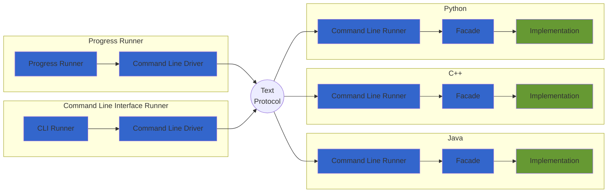

# Test tools for the coffee machine kata

This repository contains a set of tools allowing to interact with coffee machine kata implementations.

These tools are can be executed against coffee machine kata implementation in any language,
as long as a command line runner and a facade are available in this language.

## Available Tools

### Progress Runner

This tool allows to test the progress of a kata implementation.

Tests are black box tests. They are organized per iteration.

### Command line interface

This tool allow to interact with a kata implementation, through sending commands and displaying the response
sent by the implementation.

## Overall Architecture



## Repository Breakdown

This repository (`test-coffeemachine`) provides the client tool runners:

- Progress Runner
- Command Line Interface Runner

The kata repository (`kata-coffeemachine`) contains the implementation of the coffee machine kata in different
languages.
For each supported language:

- The command line runner is fully implemented.
- The facade skeleton is provided.

The parts remaining to be implemented by kata participants are

- the actual implementation of kata.
- the facade implementation, wiring the implementation to the command line runner.

## Inter Process Text Protocol

Communication between the Runner and the Implementation is done through a simple inter-process text protocol.

When the runner process is started:

- It spawns a new process calling the command line runner in the chosen language implementation.
- Its stdout is wired to the stdin of the command line runner (and vice versa).
- Request commands are sent by the runner to the command line runner through the stdin of the command line runner.
- Responses are received by the Runner through its stdin.
- Communication ends when the stdin of the command line runner is closed, an EOF is sent to it, or a shutdown
  message is sent to it.

### Global messages

These messages are generic and can be used with any kata.

#### Retrieving implementation iteration

The purpose of this message is to retrieve the current iteration of the implementation.
This provides a way to skip requests that are not implemented yet.

```text
>> iteration
<< [iteration number] + EOL
```

#### Restarting the implementation

The purpose of this message is to restart the implementation to an initial state while keeping
the command line runner process alive. This allows in particular to keep
the communication channel between the runner and the command line runner.

```text
>> restart
<< [any response] + EOL
```

#### Shutting down the implementation

The purpose of this message is to shut down the command line runner process and as a consequence
the implementation. No further communication is possible after this message.

```text
>> shutdown
<< [any response] + EOL
```

### Coffee Machine specific messages

These messages are specific to the coffee machine kata.

#### Making a drink (iteration 1 and next)

This command asks the coffee machine logic to build a drink instruction.

```text
>> make-drink [drink-name] [sugars] [money] [extra-hot]
<< [drink-instruction] + EOL
```

- [drink-name] is the name of the drink to be made ("tea", "coffee", "chocolate", "orange-juice").
- [sugars] is the number of sugars to be added to the drink (0 or a positive integer).
- [money] is the amount of money paid for the drink (0 or a positive float value).
- [extra-hot] is a flag indicating if the drink should be extra hot ("true" or "false").

#### Printing a report (iteration 3 and next)

This command asks the coffee machine logic to print a report.

```text
>> print-report
<< [report line 1] + EOL
<< [report line 2] + EOL
<< ...
<< "END-OF-REPORT" + EOL
```

#### Setting a liquid tank state (iteration 5)

This command asks the coffee machine to set the state of a liquid tank.

```text
>> set-tank [liquid-name] [state]
<< [any response] + EOL
```

- [liquid-name] is the name of the liquid tank to be set ("water", "milk").
- [state] is the status of the liquid tank ("empty", "full").

#### Dumping the mailbox contents (iteration 5)

This command asks the coffee machine to dump its mailbox contents.

```text
>> dump-mailbox
<< [message 1] + EOL
<< [message 2] + EOL
<< ...
<< "END-OF-MAILBOX" + EOL
```
