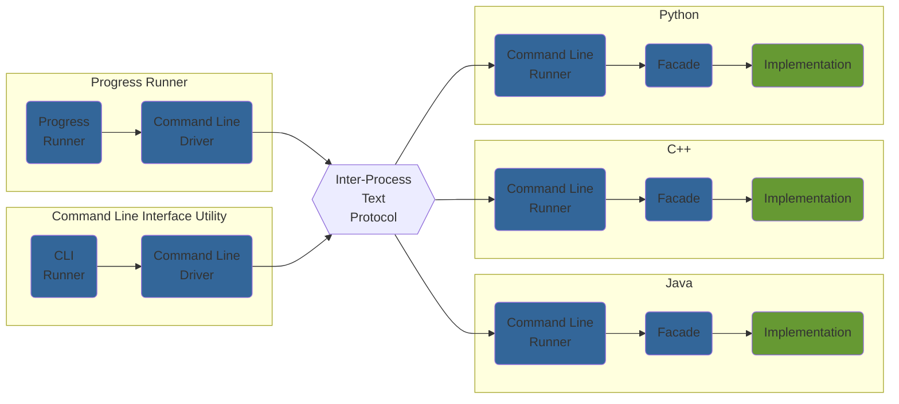

# Gamification kit for the coffee machine kata

This repository provides items focused on gamifying the coffee machine kata.

These items are by design "programming language agnostic",
e.g. they may be used with the coffee machine kata in any language.

## Available Gamification Tools

### Progress Runner

This tool allows to test the progress of a kata implementation.

Tests that are run by the progress runner are "black box" tests.

Their order of execution follows the iterations described in the kata.

### Command Line Interface utility

This tool allows to interact with a kata implementation from a terminal,
through sending commands and displaying the response sent by the implementation.

This a low-level tool which main purpose is to help tune the communication protocol
bootstrap files when adding support for a new programming language.

It's not intended to be used directly by kata participants.

## Overall Architecture

Both the Progress Runner and the Command Line Interface utility are built
on top of a common text protocol.
Refer to [Inter-Process Text Protocol](./dev-doc/inter-process-text-protocol.md) for further details.

## Repository Breakdown

This repository (`test-coffeemachine`) provides the client tool runners:

- Progress Runner
- Command Line Interface Runner

The kata repository (`kata-coffeemachine`) contains the implementation of the coffee machine kata in different
languages.
For each supported language:

- The command line runner is fully implemented.
- The facade skeleton is provided.

The parts remaining to be implemented by kata participants are

- the actual implementation of kata.
- the facade implementation, wiring the implementation to the command line runner.

## TODO

- [ ] Add a diagram with the 2 repositories
- [x] Add instructions on how to run the tools
- [x] Move protocol details to a separate page
- [ ] Add instructions on how to implement the facade in a new language
- [x] Add development instructions
- [x] Migrate this repository to murex (public)

## Building, testing and releasing coaching helpers for the coffee machine kata

Refer to [development documentation](./dev-doc/README.md) for details.

## How to Contribute?

These tools are still at an early stage of development,
and there are plenty of features that we would like to add in the future.

Refer to [CONTRIBUTING.md](./CONTRIBUTING.md) for general contribution agreement and guidelines.

## License

Contents from this repository are made available under the terms of the [MIT License](LICENSE.md)
which accompanies this distribution, and is available at the
[Open Source site](https://opensource.org/licenses/MIT).
