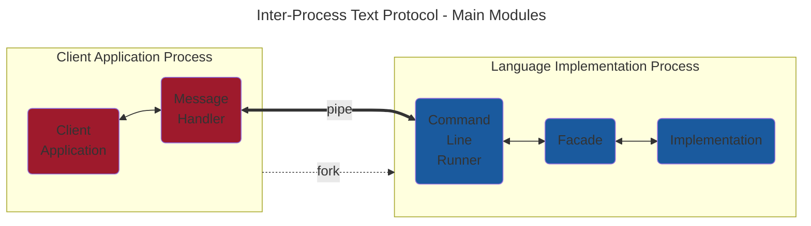
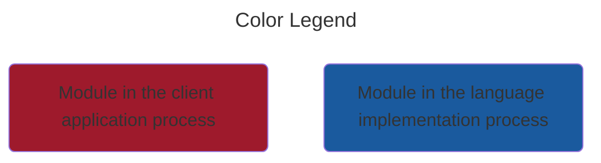

# Inter-Process Text Protocol

## Overview

Communication between the Progress Runner (or the CLI utility) and the implementation is
done through a simple inter-process text protocol built on top Unix pipes.





When the `client application process` (the Progress Runner or the CLI utility) is started:

- It spawns a new `language implementation process` for the chosen language implementation of the coffee machine.
- Its `stdout` is wired to the `stdin` of the `language implementation process` (and vice versa).
- Request commands are sent to the `language implementation process` through its `stdin`.
- Responses are captured from the `language implementation process`'s stdout.

Communication is terminated in either of these cases:

- the `language implementation process` process dies
- the `stdin` of the `language implementation process` is closed
- an `EOF` is sent to the `language implementation process`'s stdin
- a `shutdown` message (see below) is sent to the `language implementation process`'s stdin

## Global messages

These messages are generic and can be used with any kata.

### Retrieving implementation iteration

The purpose of this message is to retrieve the current iteration of the `implementation`.
This provides a way to skip requests that are not implemented yet.

```text
>> iteration
<< [iteration number] + EOL
```

### Restarting the implementation

The purpose of this message is to restart the implementation to an initial state while keeping
the `language implementation process` alive. This allows in particular to keep
the communication channel between the `client application process` and the `language implementation process`.

```text
>> restart
<< [any response] + EOL
```

### Shutting down the implementation

The purpose of this message is to shut down the `language implementation process` and as a consequence
the `implementation`. No further communication is possible after this message.

```text
>> shutdown
<< [any response] + EOL
```

## Coffee Machine specific messages

These messages are specific to the coffee machine kata.

### Making a drink (iteration 1 and next)

This command asks the coffee machine logic to build a drink instruction.

```text
>> make-drink [drink-name] [sugars] [money] [extra-hot]
<< [drink-instruction] + EOL
```

- [drink-name] is the name of the drink to be made ("tea", "coffee", "chocolate", "orange-juice").
- [sugars] is the number of sugars to be added to the drink (0 or a positive integer).
- [money] is the amount of money paid for the drink (0 or a positive float value).
- [extra-hot] is a flag indicating if the drink should be extra hot ("true" or "false").

### Printing a report (iteration 3 and next)

This command asks the coffee machine logic to print a report.

```text
>> print-report
<< [report line 1] + EOL
<< [report line 2] + EOL
<< ...
<< "END-OF-REPORT" + EOL
```

### Setting a liquid tank state (iteration 5)

This command asks the coffee machine to set the state of a liquid tank.

```text
>> set-tank [liquid-name] [state]
<< [any response] + EOL
```

- [liquid-name] is the name of the liquid tank to be set ("water", "milk").
- [state] is the status of the liquid tank ("empty", "full").

### Dumping the mailbox contents (iteration 5)

This command asks the coffee machine to dump its mailbox contents.

```text
>> dump-mailbox
<< [message 1] + EOL
<< [message 2] + EOL
<< ...
<< "END-OF-MAILBOX" + EOL
```
